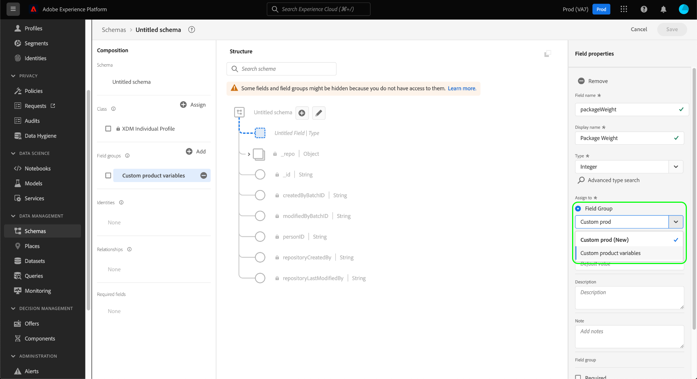

# Créer et modifier les groupes de champs de schéma dans l’interface utilisateur {#ui-create-and-edit}

>[!CONTEXTUALHELP]
>id="platform_schemas_fieldgroup_filter"
>title="Filtre de groupe de champs standards ou personnalisés"
>abstract="La liste des groupes de champs disponibles est préfiltrée en fonction de la manière dont ils ont été créés. Sélectionnez le bouton radio pour choisir entre les options Standard et Personnalisé. L’option Standard affiche les entités créées par Adobe et l’option Personnalisé affiche les entités créées au sein de votre organisation. Consultez la documentation pour en savoir plus sur la création et la modification de groupes de champs."

Dans le modèle de données d’expérience (XDM), les groupes de champs de schéma sont des composants réutilisables qui définissent un ou plusieurs champs qui implémentent certaines fonctions, telles que les détails personnels, les préférences de l’hôtel ou l’adresse. Les groupes de champs sont destinés à être inclus dans le cadre d’un schéma qui met en oeuvre une classe compatible.

Un groupe de champs définit la ou les classes avec lesquelles il est compatible, en fonction du comportement des données représentées par le groupe de champs (enregistrement ou série temporelle). Cela signifie que tous les groupes de champs ne sont pas disponibles pour toutes les classes.

Adobe Experience Platform fournit de nombreux groupes de champs standard qui couvrent un large éventail de cas d’utilisation marketing. Cependant, vous pouvez également créer et modifier vos propres groupes de champs personnalisés pour définir des concepts supplémentaires liés à votre entreprise dans vos schémas XDM. Ce guide explique comment créer, modifier et gérer des groupes de champs personnalisés pour votre organisation dans l’interface utilisateur de Platform.

## Conditions préalables {#prerequisites}

Ce guide nécessite une compréhension pratique du système XDM. Reportez-vous à la [présentation XDM](../../home.md) pour une présentation du rôle de XDM dans l’écosystème Experience Platform et aux [ principes de base de la composition des schémas](../../schema/composition.md) pour la manière dont les groupes de champs contribuent aux schémas XDM.

Bien que ce guide ne soit pas obligatoire, il est recommandé de suivre également le tutoriel sur la [composition d’un schéma dans l’interface utilisateur](../../tutorials/create-schema-ui.md) pour vous familiariser avec les différentes fonctionnalités de [!DNL Schema Editor].

## Créer un groupe de champs {#create}

Pour créer un nouveau groupe de champs, vous devez d’abord sélectionner un schéma auquel le groupe de champs sera ajouté. Vous pouvez choisir de [créer un nouveau schéma](./schemas.md#create) ou [sélectionner un schéma existant à modifier](./schemas.md#edit).

Une fois le schéma ouvert dans le [!DNL Schema Editor], sélectionnez **[!UICONTROL Ajouter]** en regard de la section [!UICONTROL Groupes de champs] dans le rail de gauche.

Dans la boîte de dialogue qui s’affiche, sélectionnez **[!UICONTROL Créer un groupe de champs]**. Vous pouvez fournir ici un **[!UICONTROL nom d’affichage]** et une **[!UICONTROL description]** pour le groupe de champs. Lorsque vous avez terminé, sélectionnez **[!UICONTROL Ajouter des groupes de champs]**.

Le [!DNL Schema Editor] réapparaît, avec le nouveau groupe de champs répertorié dans le rail de gauche. Puisqu’il s’agit d’un nouveau groupe de champs, il ne fournit actuellement aucun champ au schéma et le canevas reste donc inchangé. Vous pouvez maintenant commencer [à ajouter des champs au groupe de champs](#add-fields).

## Filtrage des groupes de champs {#filter}

La liste des groupes de champs disponibles est préfiltrée en fonction de la manière dont ils ont été créés. Le paramètre par défaut affiche les groupes de champs définis par Adobe. Cependant, vous pouvez également filtrer la liste pour afficher celles créées par votre organisation. Sélectionnez le bouton radio pour choisir entre les options [!UICONTROL Standard] et [!UICONTROL Personnalisé] . L’option [!UICONTROL Standard] affiche les entités créées par Adobe et l’option [!UICONTROL Personnalisée] affiche les entités créées dans votre organisation.

![Onglet [!UICONTROL Groupes de champs] de l’espace de travail [!UICONTROL Schémas] avec [!UICONTROL Standard] et [!UICONTROL Personnalisé] surligné.](../../images/ui/resources/field-groups/standard-and-custom-field-groups.png)

## Modifier un groupe de champs existant {#edit}

>[!NOTE]
>
>Seuls les groupes de champs personnalisés définis par votre organisation peuvent être entièrement modifiés et personnalisés. Pour les groupes de champs principaux définis par Adobe, seuls les noms d’affichage de leurs champs peuvent être modifiés dans le contexte de schémas individuels. Elles sont indiquées dans l’éditeur de schémas par une icône de cadenas (). Pour plus d’informations, reportez-vous à la section sur la [modification des noms d’affichage des champs de schéma](./schemas.md#display-names) .
>
>Une fois qu’un groupe de champs personnalisé a été enregistré et utilisé dans un schéma pour l’ingestion de données, seules des modifications supplémentaires peuvent être apportées par la suite au groupe de champs. Pour plus d’informations, voir les [règles de l’évolution du schéma](../../schema/composition.md#evolution) .

Pour modifier un groupe de champs existant, vous devez d’abord ouvrir un schéma qui utilise le groupe de champs dans le [!DNL Schema Editor]. Vous pouvez [sélectionner un schéma existant à modifier](./schemas.md#edit), ou [créer un nouveau schéma](./schemas.md#create) et ajouter le groupe de champs en question.

Une fois que le schéma est ouvert dans l’éditeur, vous pouvez commencer [à ajouter des champs au groupe de champs](#add-fields).

## Ajouter des champs à un groupe de champs {#add-fields}

>[!NOTE]
>
>Cette section porte sur l’ajout de champs à des groupes de champs personnalisés. Pour plus d’informations sur l’ajout de champs personnalisés à des groupes de champs standard, reportez-vous au [guide de l’interface utilisateur des schémas](./schemas.md#custom-fields-for-standard-groups).

Pour ajouter des champs à un groupe personnalisé, commencez par sélectionner l’icône **plus (+)** en regard du nom du schéma dans la zone de travail.

Un espace réservé **[!UICONTROL Champ sans titre]** s’affiche dans la zone de travail et le rail de droite se met à jour pour afficher les commandes permettant de configurer les propriétés du champ. Consultez le guide sur la [définition des champs dans l’interface utilisateur](../fields/overview.md#define) pour obtenir des instructions spécifiques sur la configuration de différents types de champs.

Sous **[!UICONTROL Attribuer à]**, sélectionnez l’option **[!UICONTROL Groupe de champs]**, puis utilisez la liste déroulante pour sélectionner le groupe de champs de votre choix dans la liste. Vous pouvez commencer à saisir le nom du groupe de champs pour affiner les résultats.

Sous **[!UICONTROL Attribuer à]**, sélectionnez l’option **[!UICONTROL Groupe de champs]**, puis utilisez la liste déroulante pour sélectionner le groupe de champs de votre choix dans la liste. Vous pouvez commencer à saisir le nom du groupe de champs pour affiner les résultats.

Une fois le champ ajouté au schéma, il est affecté au groupe de champs sélectionné. Continuez à ajouter autant de champs que nécessaire au groupe de champs. Lorsque vous avez terminé, sélectionnez **[!UICONTROL Enregistrer]** pour enregistrer le schéma et le groupe de champs.

Si le même groupe de champs est déjà utilisé dans d&#39;autres schémas, les champs nouvellement ajoutés apparaîtront automatiquement dans ces schémas.

## Étapes suivantes {#next-steps}

Ce guide explique comment créer et modifier des groupes de champs à l’aide de l’interface utilisateur de Platform. Pour plus d’informations sur les fonctionnalités de l’espace de travail [!UICONTROL Schémas], consultez la [[!UICONTROL présentation des schémas] de l’espace de travail](../overview.md).

Pour savoir comment gérer les groupes de champs à l’aide de l’API [!DNL Schema Registry], consultez le [guide de point de terminaison de groupes de champs](../../api/field-groups.md).
