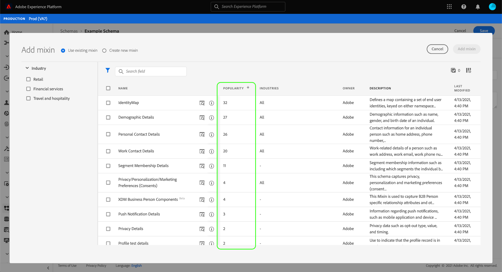
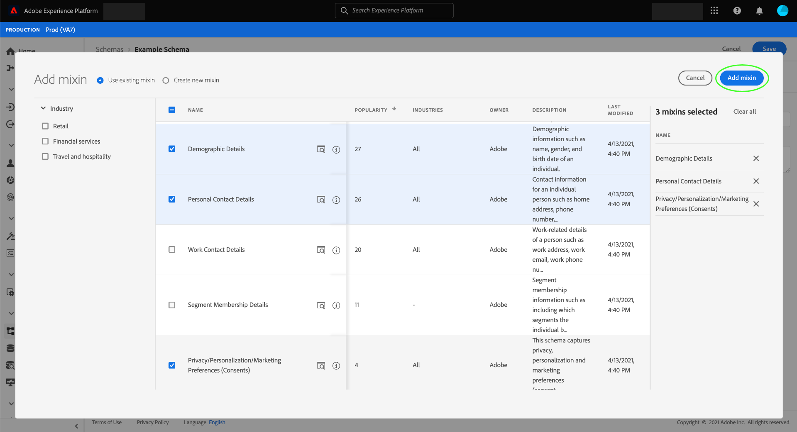

# Création et modification de schémas dans l’interface utilisateur

Ce guide présente une vue d’ensemble de la création, de la modification et de la gestion des schémas de modèle de données d’expérience (XDM) pour votre entreprise dans l’interface utilisateur de Adobe Experience Platform.

>[!IMPORTANT]
>
>Les schémas XDM sont extrêmement personnalisables. Par conséquent, les étapes de création d&#39;un schéma peuvent varier en fonction du type de données que le schéma doit capturer. En conséquence, ce document ne couvre que les interactions de base que vous pouvez effectuer avec les schémas dans l’interface utilisateur et exclut les étapes connexes telles que la personnalisation des classes, des mixins, des types de données et des champs.
>
>Pour une visite complète du processus de création de schéma, suivez le [tutoriel de création de schéma](../../tutorials/create-schema-ui.md) afin de créer un schéma d&#39;exemple complet et de vous familiariser avec les nombreuses fonctionnalités du [!DNL Schema Editor].

## Conditions préalables

Ce guide nécessite une bonne compréhension de XDM System. Pour une présentation du rôle de XDM dans l&#39;écosystème Experience Platform, voir [Présentation de XDM](../../home.md) et les [bases de la composition du schéma](../../schema/composition.md) pour un aperçu de la façon dont les schémas sont construits.

## Créer un nouveau schéma {#create}

Dans l&#39;espace de travail [!UICONTROL Schémas], sélectionnez **[!UICONTROL Créer un schéma]** dans le coin supérieur droit. Dans la liste déroulante qui s’affiche, vous pouvez choisir **[!UICONTROL Profil individuel XDM]** et **[!UICONTROL XDM ExperienceEvent]** comme classe de base pour le schéma. Vous pouvez également sélectionner **[!UICONTROL Parcourir]** dans la liste complète des classes disponibles, ou [créer une nouvelle classe personnalisée](./classes.md#create) à la place.

Une fois que vous avez sélectionné une classe, [!DNL Schema Editor] s&#39;affiche et la structure de base du schéma (fournie par la classe) s&#39;affiche dans la trame. À partir de là, vous pouvez utiliser le rail droit pour ajouter un **[!UICONTROL nom d’affichage]** et **[!UICONTROL description]** pour le schéma.

Vous pouvez désormais début de la construction de la structure du schéma en [ajoutant des mixins](#add-mixins).

## Modifier un schéma existant {#edit}

>[!NOTE]
>
>Une fois qu&#39;un schéma a été enregistré et utilisé dans l&#39;assimilation de données, il ne peut y avoir que des modifications additifs. Pour plus d&#39;informations, consultez les [règles d&#39;évolution des schémas](../../schema/composition.md#evolution).

Pour modifier un schéma existant, sélectionnez l&#39;onglet **[!UICONTROL Parcourir]**, puis sélectionnez le nom du schéma à modifier.

>[!TIP]
>
>Vous pouvez utiliser les fonctionnalités de recherche et de filtrage de l’espace de travail pour faciliter la recherche du schéma. Pour plus d&#39;informations, consultez le guide [exploration des ressources XDM](../explore.md).

Une fois que vous avez sélectionné un schéma, le [!DNL Schema Editor] apparaît avec la structure du schéma affichée dans la trame. Vous pouvez désormais [ajouter des mixins](#add-mixins) au schéma, [modifier les noms d’affichage des champs](#display-names) ou [modifier les mixins personnalisés existants](./mixins.md#edit) si le schéma en utilise un.

## Ajout de mixins à un schéma {#add-mixins}

>[!NOTE]
>
>Cette section explique comment ajouter des mixins existants à un schéma. Si vous souhaitez créer un mixin personnalisé, reportez-vous au guide intitulé [Création et modification de mixins](./mixins.md#create) à la place.

Une fois que vous avez ouvert un schéma dans [!DNL Schema Editor], vous pouvez ajouter des champs au schéma en utilisant des mixins. Pour début, sélectionnez **[!UICONTROL Ajouter]** en regard de **[!UICONTROL Mixins]** dans le rail de gauche.

Une boîte de dialogue s’affiche, présentant une liste de mixins que vous pouvez sélectionner pour le schéma. Puisque les mixins ne sont compatibles qu&#39;avec une seule classe, seuls les mixins associés à la classe sélectionnée par le schéma sont répertoriés. Par défaut, les mixins répertoriés sont triés en fonction de leur popularité d’utilisation au sein de votre entreprise.

Si vous connaissez l’activité générale ou le secteur d’activité des champs de mixin que vous souhaitez ajouter, sélectionnez une ou plusieurs catégories verticales du secteur dans le rail de gauche pour filtrer la liste affichée des mixins.

>[!NOTE]
>
>Pour plus d’informations sur les meilleures pratiques de modélisation des données spécifiques au secteur d’activité dans XDM, voir la documentation sur [les modèles de données du secteur](../../schema/industries/overview.md).

Vous pouvez également utiliser la barre de recherche pour localiser le mixin souhaité. Les mixins dont le nom correspond à la requête apparaissent en haut de la liste. Sous **[!UICONTROL Champs standard]**, des mixins contenant des champs qui décrivent les attributs de données souhaités s’affichent.

Cochez la case en regard du nom du mixin à ajouter au schéma. Vous pouvez sélectionner plusieurs mixins dans la liste, chaque mixin sélectionné apparaissant dans le rail de droite.

>[!TIP]
>
>Pour tout mixin répertorié, vous pouvez pointer ou vous concentrer sur l’icône d’informations () pour vue une brève description du type de données capturées par le mixin. Vous pouvez également sélectionner l’icône de prévisualisation () pour vue de la structure des champs fournis par le mixin avant de décider de l’ajouter au schéma.

Une fois que vous avez choisi vos mixins, sélectionnez **[!UICONTROL Ajouter le mixin]** pour les ajouter au schéma.

Le [!DNL Schema Editor] réapparaît avec les champs fournis par le mixin représentés dans la trame.

## Activation d’un schéma pour Real-time Customer Profile {#profile}

[Les ](../../../profile/home.md) profils de clients en temps réel émettent des données provenant de sources disparates pour construire une vue complète de chaque client. Si vous souhaitez que les données capturées par un schéma participent à ce processus, vous devez activer le schéma pour l&#39;utiliser dans [!DNL Profile].

>[!IMPORTANT]
>
>Pour activer un schéma pour [!DNL Profile], un champ d&#39;identité Principal doit être défini. Pour plus d&#39;informations, consultez le guide sur la [définition des champs d&#39;identité](../fields/identity.md).

Pour activer le schéma, début en sélectionnant le nom du schéma dans le rail de gauche, puis sélectionnez l&#39;option **[!UICONTROL Profil]** dans le rail de droite.

Une fenêtre contextuelle s’affiche, vous avertissant qu’une fois qu’un schéma a été activé et enregistré, il ne peut plus être désactivé. Sélectionnez **[!UICONTROL Activer]** pour continuer.

La trame réapparaît avec l&#39;activation de la bascule [!UICONTROL Profil].

>[!IMPORTANT]
>
>Comme le schéma n’est pas encore enregistré, il s’agit du point de non-retour si vous changez d’avis sur la possibilité de laisser le schéma participer au Profil client en temps réel : une fois que vous avez enregistré un schéma activé, il ne peut plus être désactivé. Sélectionnez à nouveau la bascule **[!UICONTROL Profil]** pour désactiver le schéma.

Pour terminer le processus, sélectionnez **[!UICONTROL Enregistrer]** pour enregistrer le schéma.

Le schéma est désormais activé pour une utilisation dans le Profil client en temps réel. Lorsque la plate-forme intègre des données dans des jeux de données basés sur ce schéma, ces données seront incorporées dans vos données de Profil fusionnées.

## Modifier les noms d&#39;affichage des champs de schéma {#display-names}

Une fois que vous avez affecté une classe et ajouté des mixins à un schéma, vous pouvez modifier les noms d&#39;affichage de n&#39;importe quel champ de schéma, que ces champs aient été fournis par des ressources XDM standard ou personnalisées.

>[!NOTE]
>
>N’oubliez pas que les noms d’affichage des champs appartenant à des classes standard ou des mixins ne peuvent être modifiés que dans le contexte d’un schéma spécifique. En d’autres termes, la modification du nom d’affichage d’un champ standard dans un schéma n’affecte pas les autres schémas qui utilisent la même classe ou mixin associée.

Pour modifier le nom d’affichage d’un champ de schéma, sélectionnez le champ dans la trame. Dans le rail de droite, indiquez le nouveau nom sous **[!UICONTROL Nom d’affichage]**.

Sélectionnez **[!UICONTROL Appliquer]** dans le rail de droite et la trame se met à jour pour afficher le nouveau nom d&#39;affichage du champ. Sélectionnez **[!UICONTROL Enregistrer]** pour appliquer les modifications au schéma.

## Modifier une classe de schéma {#change-class}

Vous pouvez modifier la classe d&#39;un schéma à tout moment pendant le processus de composition initial avant que le schéma n&#39;ait été enregistré.

>[!WARNING]
>
>Réassigner la classe à un schéma doit être fait avec une extrême prudence. Les mixins ne sont compatibles qu&#39;avec certaines classes. Par conséquent, modifier la classe réinitialise le canevas et les champs que vous avez ajoutés.

Pour réaffecter une classe, sélectionnez **[!UICONTROL Attribuer]** dans la partie gauche du canevas.

Une boîte de dialogue s&#39;affiche, qui affiche une liste de toutes les classes disponibles, y compris toutes les classes définies par votre organisation (le propriétaire étant &quot;[!UICONTROL Client]&quot;) ainsi que les classes standard définies par l&#39;Adobe.

Sélectionnez une classe dans la liste pour afficher sa description sur le côté droit de la boîte de dialogue. Vous pouvez également sélectionner **[!UICONTROL Prévisualisation class structure]** pour afficher les champs et les métadonnées associés à la classe. Sélectionnez **[!UICONTROL Affecter la classe]** pour continuer.

Une nouvelle boîte de dialogue s&#39;ouvre, vous demandant de confirmer que vous souhaitez affecter une nouvelle classe. Sélectionnez **[!UICONTROL Affecter]** pour confirmer.

Après avoir confirmé le changement de classe, le canevas sera réinitialisé et tous les progrès de la composition seront perdus.

## Étapes suivantes

Ce document couvrait les bases de la création et de la modification de schémas dans l’interface utilisateur de la plate-forme. Il est vivement recommandé de consulter le [didacticiel de création de schéma](../../tutorials/create-schema-ui.md) pour un flux de travail complet permettant de créer un schéma complet dans l’interface utilisateur, y compris la création de mixins personnalisés et de types de données pour des cas d’utilisation uniques.

Pour plus d&#39;informations sur les fonctionnalités de l&#39;espace de travail [!UICONTROL Schémas], consultez la présentation de l&#39;espace de travail [[!UICONTROL Schémas]](../overview.md).

Pour savoir comment gérer les schémas dans l&#39;API [!DNL Schema Registry], consultez le [guide du point de terminaison des schémas](../../api/schemas.md).
