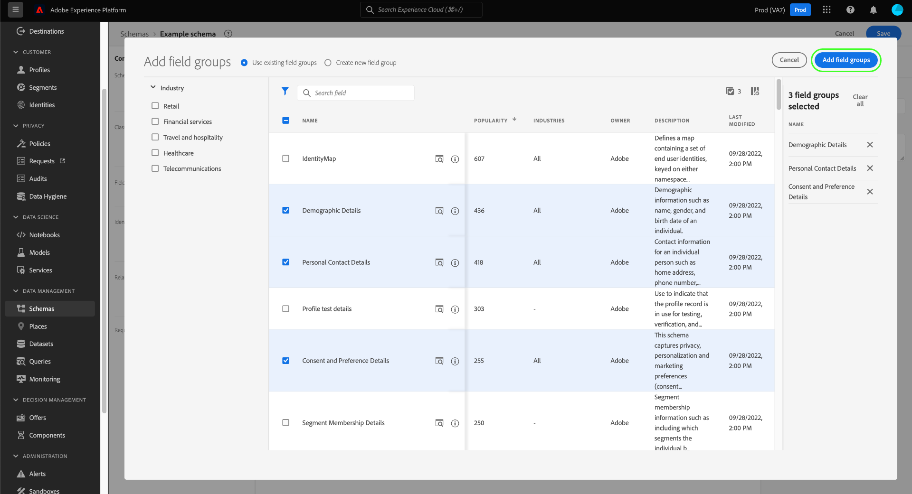

# Création et modification de schémas dans l’interface utilisateur

Ce guide explique comment créer, modifier et gérer des schémas de modèle de données d’expérience (XDM) pour votre organisation dans l’interface utilisateur de Adobe Experience Platform.

>[!IMPORTANT]
>
>Les schémas XDM sont extrêmement personnalisables. Par conséquent, les étapes de création d’un schéma peuvent varier en fonction du type de données que vous souhaitez que le schéma capture. Par conséquent, ce document couvre uniquement les interactions de base que vous pouvez effectuer avec les schémas dans l’interface utilisateur et exclut les étapes associées telles que la personnalisation des classes, des groupes de champs de schéma, des types de données et des champs.
>
>Pour une visite complète du processus de création de schéma, suivez le [tutoriel sur la création de schéma](../../tutorials/create-schema-ui.md) pour créer un schéma d’exemple complet et vous familiariser avec les nombreuses fonctionnalités de la variable [!DNL Schema Editor].

## Conditions préalables

Ce guide nécessite une compréhension pratique du système XDM. Reportez-vous à la section [Présentation de XDM](../../home.md) pour une présentation du rôle de XDM dans l’écosystème Experience Platform, et de [principes de base de la composition des schémas](../../schema/composition.md) pour un aperçu de la création des schémas.

## Création d&#39;un schéma {#create}

Dans le [!UICONTROL Schémas] espace de travail, sélectionnez **[!UICONTROL Créer un schéma]** dans le coin supérieur droit. Dans la liste déroulante qui s’affiche, vous pouvez choisir entre **[!UICONTROL XDM Individual Profile]** et **[!UICONTROL XDM ExperienceEvent]** comme classe de base du schéma. Vous pouvez également sélectionner **[!UICONTROL Parcourir]** pour effectuer une sélection dans la liste complète des classes disponibles, ou [créer une classe personnalisée](./classes.md#create) au lieu de .

Une fois que vous avez sélectionné une classe, la variable [!DNL Schema Editor] apparaît et la structure de base du schéma (fournie par la classe) s’affiche dans la zone de travail. À partir de là, vous pouvez utiliser le rail de droite pour ajouter une **[!UICONTROL Nom d’affichage]** et **[!UICONTROL Description]** pour le schéma.

Vous pouvez maintenant commencer à créer la structure du schéma en [ajout de groupes de champs de schéma](#add-field-groups).

## Modification d’un schéma existant {#edit}

>[!NOTE]
>
>Une fois qu’un schéma a été enregistré et utilisé dans l’ingestion de données, seules des modifications additifs peuvent lui être apportées. Voir [règles d’évolution des schémas](../../schema/composition.md#evolution) pour plus d’informations.

Pour modifier un schéma existant, sélectionnez l’option **[!UICONTROL Parcourir]** puis sélectionnez le nom du schéma à modifier.

>[!TIP]
>
>Vous pouvez utiliser les fonctionnalités de recherche et de filtrage de l’espace de travail pour faciliter la recherche du schéma. Consultez le guide sur la [exploration des ressources XDM](../explore.md) pour plus d’informations.

Une fois que vous avez sélectionné un schéma, la variable [!DNL Schema Editor] apparaît avec la structure du schéma affichée dans la zone de travail. Vous pouvez désormais [ajouter des groupes de champs](#add-field-groups) au schéma (ou [ajouter des champs individuels ;](#add-individual-fields) de ces groupes), [modifier les noms d’affichage des champs ;](#display-names)ou [modifier des groupes de champs personnalisés ;](./field-groups.md#edit) si le schéma en utilise un.

## Ajout de groupes de champs à un schéma {#add-field-groups}

>[!NOTE]
>
>Cette section explique comment ajouter des groupes de champs existants à un schéma. Si vous souhaitez créer un groupe de champs personnalisé, consultez le guide sur [création et modification de groupes de champs](./field-groups.md#create) au lieu de .

Une fois que vous avez ouvert un schéma dans la fonction [!DNL Schema Editor], vous pouvez ajouter des champs au schéma à l’aide de groupes de champs. Pour commencer, sélectionnez **[!UICONTROL Ajouter]** en regard de **[!UICONTROL Groupes de champs]** dans le rail de gauche.

Une boîte de dialogue s’affiche, affichant la liste des groupes de champs que vous pouvez sélectionner pour le schéma. Puisque les groupes de champs ne sont compatibles qu’avec une seule classe, seuls les groupes de champs associés à la classe sélectionnée du schéma sont répertoriés. Par défaut, les groupes de champs répertoriés sont triés en fonction de leur popularité d’utilisation au sein de votre entreprise.

Si vous connaissez l’activité générale ou le domaine d’activité des champs que vous souhaitez ajouter, sélectionnez une ou plusieurs des catégories verticales du secteur dans le rail de gauche pour filtrer la liste affichée des groupes de champs.

>[!NOTE]
>
>Pour plus d’informations sur les bonnes pratiques relatives à la modélisation de données spécifique au secteur dans XDM, consultez la documentation sur [modèles de données du secteur](../../schema/industries/overview.md).

Vous pouvez également utiliser la barre de recherche pour localiser le groupe de champs souhaité. Les groupes de champs dont le nom correspond à la requête apparaissent en haut de la liste. Sous **[!UICONTROL Champs standard]**, les groupes de champs contenant les champs qui décrivent les attributs de données souhaités s’affichent.

Cochez la case en regard du nom du groupe de champs que vous souhaitez ajouter au schéma. Vous pouvez sélectionner plusieurs groupes de champs dans la liste, chaque groupe de champs sélectionné apparaissant dans le rail de droite.

>[!TIP]
>
>Pour tout groupe de champs répertorié, vous pouvez pointer ou vous concentrer sur l’icône d’informations () pour afficher une brève description du type de données que le groupe de champs capture. Vous pouvez également sélectionner l’icône d’aperçu () pour afficher la structure des champs que le groupe de champs fournit avant de décider de l’ajouter au schéma.

Une fois que vous avez choisi vos groupes de champs, sélectionnez **[!UICONTROL Ajouter des groupes de champs]** pour les ajouter au schéma.

Le [!DNL Schema Editor] réapparaît avec les champs fournis par le groupe de champs représentés dans la zone de travail.

Après avoir ajouté un groupe de champs à un schéma, vous pouvez éventuellement [supprimer des champs existants](#remove-fields) ou [ajout de nouveaux champs personnalisés](#add-fields) à ces groupes, en fonction de vos besoins.

### Supprimer les champs ajoutés des groupes de champs {#remove-fields}

Après avoir ajouté un groupe de champs à un schéma, vous pouvez supprimer tous les champs dont vous n’avez pas besoin.

>[!NOTE]
>
>La suppression de champs d’un groupe de champs affecte uniquement le schéma en cours de traitement et n’affecte pas le groupe de champs lui-même. Si vous supprimez des champs dans un schéma, ces champs sont toujours disponibles dans tous les autres schémas qui utilisent le même groupe de champs.

Dans l&#39;exemple suivant, le groupe de champs standard **[!UICONTROL Détails démographiques]** a été ajouté à un schéma. Pour supprimer un seul champ, par exemple `taxId`, sélectionnez le champ dans la zone de travail, puis sélectionnez **[!UICONTROL Supprimer]** dans le rail de droite.

Si vous souhaitez supprimer plusieurs champs, vous pouvez gérer le groupe dans son ensemble. Sélectionnez un champ appartenant au groupe dans la zone de travail, puis sélectionnez **[!UICONTROL Gestion des champs associés]** dans le rail de droite.

Une boîte de dialogue s’affiche, indiquant la structure du groupe de champs en question. À partir de là, vous pouvez utiliser les cases à cocher fournies pour sélectionner ou désélectionner les champs dont vous avez besoin. Lorsque vous êtes satisfait, sélectionnez **[!UICONTROL Confirmer]**.

Le canevas réapparaît avec uniquement les champs sélectionnés présents dans la structure du schéma.

### Ajout de champs personnalisés aux groupes de champs {#add-fields}

Après avoir ajouté un groupe de champs à un schéma, vous pouvez définir des champs supplémentaires pour ce groupe. Cependant, tous les champs ajoutés à un groupe de champs dans un schéma apparaîtront également dans tous les autres schémas qui utilisent ce même groupe de champs.

En outre, si un champ personnalisé est ajouté à un groupe de champs standard, ce groupe sera converti en groupe de champs personnalisé et le groupe de champs standard d’origine ne sera plus disponible.

Si vous souhaitez ajouter un champ personnalisé à un groupe de champs standard, reportez-vous à la section [section ci-dessous](#custom-fields-for-standard-groups) pour obtenir des instructions spécifiques. Si vous ajoutez des champs à un groupe de champs personnalisé, reportez-vous à la section sur [modification de groupes de champs personnalisés](./field-groups.md) dans le guide de l’interface utilisateur des groupes de champs.

Si vous ne souhaitez modifier aucun groupe de champs existant, vous pouvez [créer un groupe de champs personnalisé](./field-groups.md#create) pour définir des champs supplémentaires.

## Ajout de champs individuels à un schéma {#add-individual-fields}

L’éditeur de schémas vous permet d’ajouter des champs individuels directement à un schéma si vous souhaitez éviter d’ajouter un groupe de champs entier pour un cas d’utilisation spécifique. Vous pouvez [ajouter des champs individuels à partir de groupes de champs standard ;](#add-standard-fields) ou [ajouter vos propres champs personnalisés](#add-custom-fields) au lieu de .

>[!IMPORTANT]
>
>Même si l’éditeur de schémas permet fonctionnellement d’ajouter des champs individuels directement à un schéma, cela ne change pas le fait que tous les champs d’un schéma XDM doivent être fournis par sa classe ou un groupe de champs compatible avec cette classe. Comme les sections ci-dessous l’expliquent, tous les champs individuels sont toujours associés à un groupe de champs comme étape clé lorsqu’ils sont ajoutés à un schéma.

### Ajouter des champs standard {#add-standard-fields}

Vous pouvez ajouter directement à un schéma des champs provenant de groupes de champs standard sans avoir à connaître au préalable le groupe de champs correspondant. Pour ajouter un champ standard à un schéma, sélectionnez le plus (**+**) en regard du nom du schéma dans la zone de travail. Un **[!UICONTROL Champ sans titre]** un espace réservé apparaît dans la structure du schéma et le rail de droite est mis à jour pour afficher les commandes permettant de configurer le champ.

Sous **[!UICONTROL Nom du champ]**, commencez à saisir le nom du champ à ajouter. Le système recherche automatiquement les champs standard correspondant à la requête et les répertorie sous **[!UICONTROL Champs standard recommandés]**, y compris les groupes de champs auxquels ils appartiennent.

Bien que certains champs standard portent le même nom, leur structure peut varier en fonction du groupe de champs d’où ils proviennent. Si un champ standard est imbriqué dans un objet parent dans la structure du groupe de champs, le champ parent sera également inclus dans le schéma si le champ enfant est ajouté.

Sélectionnez l’icône d’aperçu () en regard d’un champ standard pour afficher la structure de son groupe de champs et mieux comprendre comment il peut être imbriqué. Pour ajouter le champ standard au schéma, sélectionnez l’icône plus ().

Le canevas se met à jour pour afficher le champ standard ajouté au schéma, y compris tous les champs parents sous lesquels il est imbriqué dans la structure du groupe de champs. Le nom du groupe de champs est également répertorié sous **[!UICONTROL Groupes de champs]** dans le rail de gauche. Si vous souhaitez ajouter d’autres champs à partir du même groupe de champs, sélectionnez **[!UICONTROL Gestion des champs associés]** dans le rail de droite.

### Ajouter des champ personnalisés       {#add-custom-fields}

Tout comme le workflow pour les champs standard, vous pouvez également ajouter vos propres champs personnalisés directement à un schéma.

Pour ajouter des champs au niveau racine d’un schéma, sélectionnez le plus (**+**) en regard du nom du schéma dans la zone de travail. Un **[!UICONTROL Champ sans titre]** un espace réservé apparaît dans la structure du schéma et le rail de droite est mis à jour pour afficher les commandes permettant de configurer le champ.

Commencez à saisir le nom du champ que vous souhaitez ajouter, et le système commence automatiquement à rechercher les champs standards correspondants. Pour créer un champ personnalisé à la place, sélectionnez l’option supérieure annexée avec **([!UICONTROL Nouveau champ])**.

À partir de là, indiquez un nom d’affichage et un type de données pour le champ. Sous **[!UICONTROL Attribuer un groupe de champs]**, vous devez sélectionner un groupe de champs pour le nouveau champ à associer. Commencez à saisir le nom du groupe de champs, et si vous avez déjà [création de groupes de champs personnalisés](./field-groups.md#create) elles s’affichent dans la liste déroulante. Vous pouvez également saisir un nom unique dans le champ pour créer un groupe de champs à la place.

>[!WARNING]
>
>Si vous sélectionnez un groupe de champs personnalisé existant, tout autre schéma qui l’emploie héritera également du nouveau champ ajouté après avoir enregistré vos modifications. Pour cette raison, sélectionnez un groupe de champs existant uniquement si vous souhaitez ce type de propagation. Dans le cas contraire, vous devez choisir de créer un groupe de champs personnalisé.

Lorsque vous avez terminé, sélectionnez **[!UICONTROL Appliquer]**.

Le nouveau champ est ajouté à la zone de travail et est un espace de noms sous votre [identifiant du client](../../api/getting-started.md#know-your-tenant_id) pour éviter les conflits avec les champs XDM standard. Le groupe de champs auquel vous avez associé le nouveau champ apparaît également sous **[!UICONTROL Groupes de champs]** dans le rail de gauche.

>[!NOTE]
>
>Les autres champs fournis par le groupe de champs personnalisé sélectionné sont supprimés du schéma par défaut. Si vous souhaitez ajouter certains de ces champs au schéma, sélectionnez un champ appartenant au groupe, puis sélectionnez **[!UICONTROL Gestion des champs associés]** dans le rail de droite.

#### Ajouter des champs personnalisés à la structure des groupes de champs standard {#custom-fields-for-standard-groups}

Si le schéma sur lequel vous travaillez comporte un champ de type objet fourni par un groupe de champs standard, vous pouvez ajouter vos propres champs personnalisés à cet objet standard.

>[!WARNING]
>
>Tous les champs ajoutés à un groupe de champs dans un schéma apparaîtront également dans tous les autres schémas qui utilisent ce même groupe de champs. En outre, si un champ personnalisé est ajouté à un groupe de champs standard, ce groupe sera converti en groupe de champs personnalisé et le groupe de champs standard d’origine ne sera plus disponible.
>
>Si vous avez participé à la version bêta de cette fonctionnalité, vous recevrez une boîte de dialogue vous informant des groupes de champs standard que vous avez précédemment personnalisés. Une fois que vous avez sélectionné **[!UICONTROL Reconnaissance]**, les ressources répertoriées sont converties en groupes de champs personnalisés.
>
>

Pour commencer, sélectionnez le plus (**+**) en regard de la racine de l’objet fourni par le groupe de champs standard.

Un message d’avertissement s’affiche, vous invitant à confirmer la conversion du groupe de champs standard. Sélectionner **[!UICONTROL Continuer à créer un groupe de champs]** pour continuer.

Le canevas réapparaît avec un espace réservé sans titre pour le nouveau champ. Notez que le nom du groupe de champs standard a été ajouté avec &quot;([!UICONTROL Étendu])&quot; pour indiquer qu’il a été modifié à partir de la version d’origine. À partir de là, utilisez les commandes du rail de droite pour définir les propriétés du champ.

Après avoir appliqué vos modifications, le nouveau champ s’affiche sous l’espace de noms de l’identifiant du client dans l’objet standard. Cet espace de noms imbriqué empêche les conflits de nom de champ dans le groupe de champs lui-même afin d’éviter de rompre les modifications dans d’autres schémas qui utilisent le même groupe de champs.

## Activation d’un schéma pour Real-time Customer Profile {#profile}

[Real-time Customer Profile](../../../profile/home.md) fusionne les données provenant de sources disparates afin de créer une vue complète de chaque client. Si vous souhaitez que les données capturées par un schéma participent à ce processus, vous devez activer le schéma à utiliser dans [!DNL Profile].

>[!IMPORTANT]
>
>Pour activer un schéma pour [!DNL Profile], un champ d’identité Principal doit être défini pour celui-ci. Consultez le guide sur la [définition des champs d’identité](../fields/identity.md) pour plus d’informations.

Pour activer le schéma, sélectionnez d’abord le nom du schéma dans le rail de gauche, puis sélectionnez l’option **[!UICONTROL Profil]** bascule dans le rail de droite.

Une fenêtre contextuelle s’affiche, vous avertissant qu’une fois qu’un schéma a été activé et enregistré, il ne peut pas être désactivé. Sélectionner **[!UICONTROL Activer]** pour continuer.

La zone de travail réapparaît avec la fonction [!UICONTROL Profil] bascule activé.

>[!IMPORTANT]
>
>Comme le schéma n’est pas encore enregistré, il s’agit d’un point de non-retour si vous changez d’avis concernant la possibilité de laisser le schéma participer à Real-time Customer Profile : une fois que vous avez enregistré un schéma activé, il ne peut plus être désactivé. Sélectionnez la **[!UICONTROL Profil]** basculez à nouveau pour désactiver le schéma.

Pour terminer le processus, sélectionnez **[!UICONTROL Enregistrer]** pour enregistrer le schéma.

Le schéma est désormais activé pour une utilisation dans Real-time Customer Profile. Lorsque Platform ingère des données dans des jeux de données en fonction de ce schéma, ces données sont intégrées à vos données de profil fusionnées.

## Modification des noms d’affichage des champs de schéma {#display-names}

Une fois que vous avez affecté une classe et ajouté des groupes de champs à un schéma, vous pouvez modifier les noms d’affichage de l’un des champs du schéma, que ces champs aient été fournis par des ressources XDM standard ou personnalisées.

>[!NOTE]
>
>Gardez à l’esprit que les noms d’affichage des champs appartenant à des classes standard ou à des groupes de champs ne peuvent être modifiés que dans le contexte d’un schéma spécifique. En d’autres termes, la modification du nom d’affichage d’un champ standard dans un schéma n’a aucun effet sur les autres schémas qui utilisent la même classe ou le même groupe de champs associé.
>
>Une fois que vous avez apporté des modifications aux noms d’affichage des champs d’un schéma, ces modifications sont immédiatement répercutées dans les jeux de données existants basés sur ce schéma.

Pour modifier le nom d’affichage d’un champ de schéma, sélectionnez le champ dans la zone de travail. Dans le rail de droite, indiquez le nouveau nom sous **[!UICONTROL Nom d’affichage]**.

Sélectionner **[!UICONTROL Appliquer]** dans le rail de droite, et la zone de travail se met à jour pour afficher le nouveau nom d’affichage du champ. Sélectionner **[!UICONTROL Enregistrer]** pour appliquer les modifications au schéma.

## Modification de la classe d’un schéma {#change-class}

Vous pouvez modifier la classe d’un schéma à tout moment pendant le processus de composition initial avant l’enregistrement du schéma.

>[!WARNING]
>
>La réattribution de la classe pour un schéma doit être effectuée avec une extrême prudence. Les groupes de champs ne sont compatibles qu’avec certaines classes. Par conséquent, la modification de la classe réinitialise le canevas et les champs que vous avez ajoutés.

Pour réaffecter une classe, sélectionnez **[!UICONTROL Attribuer]** dans la partie gauche du canevas.

Une boîte de dialogue s’affiche, qui affiche une liste de toutes les classes disponibles, y compris toutes les classes définies par votre organisation (le propriétaire étant &quot;[!UICONTROL Client]&quot;) ainsi que les classes standard définies par Adobe.

Sélectionnez une classe dans la liste pour afficher sa description sur le côté droit de la boîte de dialogue. Vous pouvez également sélectionner **[!UICONTROL Aperçu de la structure de classe]** pour afficher les champs et les métadonnées associés à la classe. Sélectionner **[!UICONTROL Attribuer une classe]** pour continuer.

Une nouvelle boîte de dialogue s’ouvre, vous demandant de confirmer que vous souhaitez attribuer une nouvelle classe. Sélectionner **[!UICONTROL Attribuer]** pour confirmer.

Après avoir confirmé la modification de classe, le canevas est réinitialisé et toute progression de la composition est perdue.

## Étapes suivantes

Ce document couvrait les principes de base de la création et de la modification de schémas dans l’interface utilisateur de Platform. Il est vivement recommandé de consulter la section [tutoriel sur la création de schéma](../../tutorials/create-schema-ui.md) pour un processus complet de création d’un schéma complet dans l’interface utilisateur, notamment la création de groupes de champs personnalisés et de types de données pour des cas d’utilisation uniques.

Pour plus d’informations sur les fonctionnalités de la variable [!UICONTROL Schémas] workspace, voir [[!UICONTROL Schémas] présentation de workspace](../overview.md).

Pour savoir comment gérer les schémas dans le [!DNL Schema Registry] API, voir [guide de point d’entrée des schémas](../../api/schemas.md).
