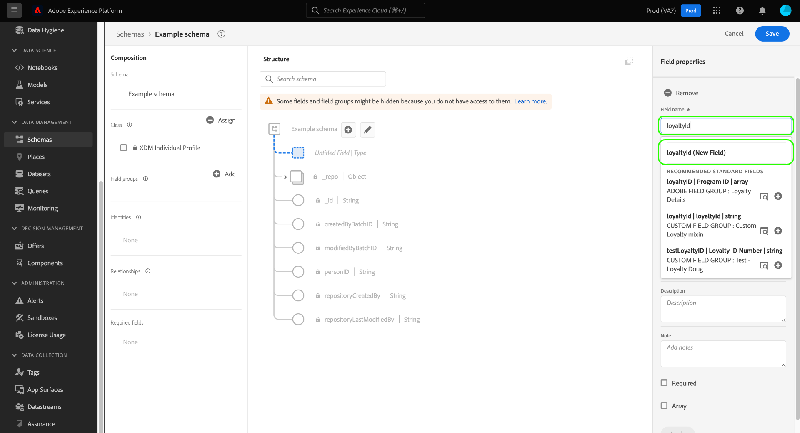

# Créer et modifier les schémas dans l’interface utilisateur {#create-edit-schemas-in-ui}

Ce guide présente la création, la modification et la gestion des schémas de modèle de données d’expérience (XDM) pour votre organisation dans l’interface utilisateur de Adobe Experience Platform.

>[!IMPORTANT]
>
>Les schémas XDM sont extrêmement personnalisables. Par conséquent, les étapes de création d’un schéma peuvent varier en fonction du type de données que vous souhaitez que le schéma capture. Par conséquent, ce document ne couvre que les interactions de base que vous pouvez effectuer avec les schémas dans l’interface utilisateur et exclut les étapes associées, telles que la personnalisation des classes, des groupes de champs de schéma, des types de données et des champs.
>
>Pour une visite complète du processus de création de schéma, suivez le [tutoriel sur la création de schémas](../../tutorials/create-schema-ui.md) afin de créer un exemple de schéma complet et de vous familiariser avec les nombreuses fonctionnalités de l’[!DNL Schema Editor].

## Conditions préalables {#prerequisites}

Ce guide nécessite une compréhension pratique du système XDM. Reportez-vous à la [présentation de XDM](../../home.md) pour une introduction au rôle de XDM dans l’écosystème Experience Platform et aux [principes de base de la composition des schémas](../../schema/composition.md) pour une présentation de la construction des schémas.

## Créer un schéma {#create}

Dans l’espace de travail [!UICONTROL Schemas], sélectionnez **[!UICONTROL Create schema]** dans le coin supérieur droit. Le menu déroulant « Sélectionner le type de schéma » s’affiche avec des options pour les schémas [!UICONTROL Standard] ou [!UICONTROL Relational].

![L’espace de travail Schémas avec l’[!UICONTROL Create Schema] en surbrillance et le menu déroulant « Sélectionner le type de schéma » affiché](../../images/ui/resources/schemas/create-schema.png).

## Créer un schéma relationnel {#create-relational-schema}

>[!AVAILABILITY]
>
>Les schémas Data Mirror et relationnels sont disponibles pour les détenteurs de licence Adobe Journey Optimizer **Campagnes orchestrées**. Ils sont également disponibles en tant que **version limitée** pour les utilisateurs de Customer Journey Analytics, selon votre licence et l’activation des fonctionnalités. Contactez votre représentant Adobe pour obtenir l’accès.

>[!NOTE]
>
>Les schémas relationnels étaient auparavant appelés schémas basés sur des modèles dans les versions antérieures de la documentation de Adobe Experience Platform.

Sélectionnez **[!UICONTROL Relational]** pour définir des schémas de style relationnel structurés avec un contrôle précis des enregistrements. Les schémas relationnels prennent en charge l’application des clés primaires, le contrôle de version au niveau des enregistrements et les relations au niveau du schéma par le biais de clés primaires et étrangères. Ils sont également optimisés pour l’ingestion incrémentielle à l’aide de la capture de données de modification et prennent en charge plusieurs modèles de données utilisés dans les implémentations Campaign Orchestration, Data Distiller et B2B.

Pour en savoir plus, consultez la présentation de [Data Mirror](../../data-mirror/overview.md) ou [Schéma relationnel](../../schema/relational.md).

### Créer manuellement {#create-manually}

>[!AVAILABILITY]
>
>Le chargement de fichier DDL est uniquement disponible pour les détenteurs de licence Adobe Journey Optimizer Orchestrated Campaign. L’interface utilisateur peut avoir un aspect différent.

La boîte de dialogue **[!UICONTROL Create a relational schema]** s’affiche. Vous pouvez choisir **[!UICONTROL Create manually]** ou [**[!UICONTROL Upload DDL file]**](#upload-ddl-file) pour définir la structure du schéma.

Dans la boîte de dialogue **[!UICONTROL Create a relational schema]**, sélectionnez **[!UICONTROL Create manually]**, puis **[!UICONTROL Next]**.

La page **[!UICONTROL Relational schema details]** s’affiche. Saisissez un nom d’affichage de schéma et une description facultative, puis sélectionnez **[!UICONTROL Finish]** pour créer le schéma.

![Vue détaillée du schéma relationnel avec [!UICONTROL Schema display name], [!UICONTROL Description] et [!UICONTROL Finish] mis en surbrillance.](../../images/ui/resources/schemas/relational-details.png)

L’éditeur de schémas s’ouvre avec une zone de travail vide pour définir la structure du schéma. Vous pouvez ajouter des champs comme vous le faites habituellement.

#### Ajout d’un champ d’identifiant de version {#add-version-identifier}

Pour activer le suivi de version et prendre en charge la capture de données de modification, vous devez désigner un champ d’identifiant de version dans votre schéma. Dans l’éditeur de schémas, sélectionnez l’icône plus () à côté du nom du schéma pour ajouter un nouveau champ.

Saisissez un nom de champ tel que `updateSequence` et choisissez un type de données **[!UICONTROL DateTime]** ou **[!UICONTROL Number]**.

Dans le rail de droite, activez la case à cocher **[!UICONTROL Version Identifier]**, puis sélectionnez **[!UICONTROL Apply]** pour confirmer le champ.

>[!IMPORTANT]
>
>Un schéma relationnel doit inclure un champ d’identifiant de version pour prendre en charge les mises à jour au niveau des enregistrements et modifier l’ingestion de la capture de données.

Pour définir des relations, sélectionnez **[!UICONTROL Add Relationship]** dans l’éditeur de schémas pour créer des relations clé primaire/étrangère au niveau du schéma. Pour plus d’informations, consultez le tutoriel sur [l’ajout de relations au niveau du schéma](../../tutorials/relationship-ui.md#relationship-field).

Ensuite, passez à [définir des clés primaires](../fields/identity.md#define-a-identity-field) et [ajouter des champs supplémentaires](#add-field-groups) si nécessaire. Pour obtenir des instructions sur la manière d’activer la capture de données de modification dans les sources Experience Platform, consultez le [guide d’ingestion de capture de données de modification](../../../sources/tutorials/api/change-data-capture.md).

>[!NOTE]
>
>Une fois enregistré, le champ [!UICONTROL Type] de la barre latérale [!UICONTROL &#x200B; Schema properties] indique qu’il s’agit d’un schéma [!UICONTROL Relational]. Cela est également indiqué dans la barre latérale des détails dans la vue d’inventaire des schémas.
>

### Charger un fichier DDL {#upload-ddl-file}

>[!AVAILABILITY]
>
>Le chargement de fichier DDL est uniquement disponible pour les détenteurs de licence Adobe Journey Optimizer Orchestrated Campaign.

Utilisez ce workflow pour définir le schéma en chargeant un fichier DDL. Dans la boîte de dialogue **[!UICONTROL Create a relational schema]**, sélectionnez **[!UICONTROL Upload DDL file]**, puis faites glisser un fichier DDL local depuis votre système ou sélectionnez **[!UICONTROL Choose files]**. Experience Platform valide le schéma et affiche une coche verte si le chargement du fichier réussit. Sélectionnez **[!UICONTROL Next]** pour confirmer le chargement.

![La boîte de dialogue Créer un schéma relationnel avec [!UICONTROL Upload DDL file] sélectionné et [!UICONTROL Next] mis en surbrillance.](../../images/ui/resources/schemas/upload-ddl-file.png)

La boîte de dialogue [!UICONTROL Select entities and fields to import] s’affiche, vous permettant de prévisualiser le schéma. Vérifiez la structure du schéma et utilisez les boutons radio et les cases à cocher pour vous assurer que chaque entité dispose d’une clé primaire et d’un identifiant de version spécifiés.

>[!IMPORTANT]
>
>La structure de la table doit contenir une **clé primaire** et un **identifiant de version**, tel qu&#39;un champ `updateSequence` de type datetime ou number.
>
>Pour l’ingestion de capture de données de modification, une colonne spéciale nommée `_change_request_type` de type Chaîne est également nécessaire pour activer le traitement incrémentiel. Ce champ indique le type de modification des données (par exemple, `u` (upsert) ou `d` (delete)).

Bien que cela soit nécessaire lors de l’ingestion, les colonnes de contrôle telles que `_change_request_type` ne sont pas stockées dans le schéma et n’apparaissent pas dans la structure de schéma finale. Si tout semble correct, sélectionnez **[!UICONTROL Done]** pour créer le schéma.

>[!NOTE]
>
>La taille de fichier maximale prise en charge pour un chargement DDL est de 10 Mo.

![La vue de révision du schéma relationnel avec les champs importés affichés et [!UICONTROL Finish] mis en surbrillance.](../../images/ui/resources/schemas/entities-and-files-to-inport.png)

Le schéma s’ouvre dans l’éditeur de schémas, où vous pouvez ajuster la structure avant d’enregistrer.

Ensuite, passez à [ajouter des champs supplémentaires](#add-field-groups) et [ajouter des relations supplémentaires au niveau du schéma](../../tutorials/relationship-ui.md#relationship-field) si nécessaire.

Pour obtenir des instructions sur la manière d’activer la capture de données de modification dans les sources Experience Platform, consultez le [guide d’ingestion de capture de données de modification](../../../sources/tutorials/api/change-data-capture.md).

## Création de schéma standard {#standard-based-creation}

Si vous sélectionnez « Type de schéma standard » dans le menu déroulant « Sélectionner le type de schéma », la boîte de dialogue [!UICONTROL Create a schema] s’affiche. Dans cette boîte de dialogue, vous pouvez choisir de créer manuellement un schéma en ajoutant des champs et des groupes de champs, ou de charger un fichier CSV et d’utiliser des algorithmes ML pour générer un schéma. Sélectionnez un workflow de création de schéma dans la boîte de dialogue.

### [!BADGE Beta &#x200B;]{type=Informative} création manuelle ou assistée par machine learning de schéma {#manual-or-assisted}

Pour découvrir comment utiliser un algorithme ML afin de recommander une structure de schéma basée sur un fichier csv, consultez le guide de création de schéma assisté par machine learning [machine learning](../ml-assisted-schema-creation.md). Ce guide de l’interface utilisateur se concentre sur le workflow de création manuelle .

### Création manuelle de schéma {#manual-creation}

Le workflow [!UICONTROL Create schema] s’affiche. Vous pouvez choisir une classe de base pour le schéma en sélectionnant **[!UICONTROL Individual Profile]**, **[!UICONTROL Experience Event]** ou **[!UICONTROL Other]**, suivi de **[!UICONTROL Next]** pour confirmer votre choix. Pour plus d’informations sur ces classes, consultez la documentation [[!UICONTROL XDM individual profile]](../../classes/individual-profile.md) et [[!UICONTROL XDM ExperienceEvent]](../../classes/experienceevent.md) .

![Workflow [!UICONTROL Create schema] avec les trois options de classe et les [!UICONTROL Next] mises en surbrillance.](../../images/ui/resources/schemas/schema-class-options.png)

Lorsque vous choisissez **[!UICONTROL Other]**, une liste des classes disponibles s’affiche. À partir de là, vous pouvez parcourir et filtrer les classes préexistantes.

![Workflow [!UICONTROL Create schema] avec [!UICONTROL Other] mis en surbrillance dans la section [!UICONTROL Schema details].](../../images/ui/resources/schemas/other-schema-details.png)

Sélectionnez un bouton radio pour filtrer les classes selon qu’il s’agit de classes personnalisées ou standard. Vous pouvez également filtrer les résultats disponibles en fonction de leur secteur d’activité ou rechercher une classe spécifique à l’aide du champ de recherche.

![Workflow [!UICONTROL Create schema] avec la barre de recherche, les [!UICONTROL Custom] et les [!UICONTROL Industries] mis en surbrillance.](../../images/ui/resources/schemas/filter-and-search.png)

Pour vous aider à choisir la classe appropriée, il existe des icônes d’informations et de prévisualisation pour chaque classe. L’icône d’informations () ouvre une boîte de dialogue qui fournit une description de la classe et du secteur auquel elle est associée.

L’icône d’aperçu () ouvre une boîte de dialogue de prévisualisation pour la classe qui contient un diagramme de schéma et ses propriétés.

Sélectionnez une ligne pour choisir une classe, puis sélectionnez **[!UICONTROL Next]** pour confirmer votre choix.

![Workflow [!UICONTROL Create schema] avec une classe sélectionnée dans le tableau des classes disponibles et [!UICONTROL Next] mise en surbrillance.](../../images/ui/resources/schemas/select-class.png)

Après avoir sélectionné une classe, la section [!UICONTROL Name and review] s’affiche. Dans cette section, vous indiquez un nom et une description pour identifier votre schéma. &#x200B;La structure de base du schéma (fournie par la classe ) s’affiche dans la zone de travail. Vous pouvez ainsi consulter et vérifier la structure de classe et de schéma sélectionnée.

Saisissez un [!UICONTROL Schema display name] convivial dans le champ de texte. Saisissez ensuite une description appropriée pour vous aider à identifier votre schéma. Une fois que vous avez révisé votre structure de schéma et que vos paramètres vous conviennent, sélectionnez **[!UICONTROL Finish]** pour créer votre schéma.

![Section [!UICONTROL Name and review] du workflow de [!UICONTROL Create schema] avec les [!UICONTROL Schema display name], [!UICONTROL Description] et [!UICONTROL Finish] en surbrillance.](../../images/ui/resources/schemas/name-and-review.png)

L’éditeur de schémas s’affiche, avec la structure du schéma affichée dans la zone de travail. Si vous le souhaitez, vous pouvez maintenant commencer [à ajouter des champs à la classe](../../ui/resources/classes.md#add-fields).

## Modification d’un schéma existant {#edit}

>[!NOTE]
>
>Une fois qu’un schéma a été enregistré et utilisé dans l’ingestion de données, seules des modifications supplémentaires peuvent lui être apportées. Pour plus d’informations, consultez la section [règles d’évolution des schémas](../../schema/composition.md#evolution) .

Pour modifier un schéma existant, sélectionnez l’onglet **[!UICONTROL Browse]** , puis sélectionnez le nom du schéma à modifier. Vous pouvez également utiliser la barre de recherche pour affiner la liste des options disponibles.

>[!TIP]
>
>Vous pouvez utiliser les fonctionnalités de recherche et de filtrage de l’espace de travail pour faciliter la recherche du schéma. Pour plus d’informations, consultez le guide sur l’[exploration des ressources XDM](../explore.md).

Une fois que vous avez sélectionné un schéma, la [!DNL Schema Editor] s’affiche avec la structure du schéma affichée dans la zone de travail. Vous pouvez désormais [ajouter des groupes de champs](#add-field-groups) au schéma (ou [ajouter des champs individuels](#add-individual-fields) à partir de ces groupes), [modifier les noms d’affichage des champs](#display-names) ou [modifier les groupes de champs personnalisés existants](./field-groups.md#edit) si le schéma en utilise.

## Actions supplémentaires {#more}

Dans l’éditeur de schémas, vous pouvez également effectuer des actions rapides pour copier la structure JSON du schéma ou supprimer le schéma s’il n’a pas été activé pour le profil client en temps réel ou s’il est associé à des jeux de données. Sélectionnez [!UICONTROL More] en haut de la vue pour afficher une liste déroulante avec des actions rapides.

La fonctionnalité Copier la structure JSON vous permet de voir à quoi ressemblerait un exemple de payload pendant que vous créez le schéma et vos pipelines de données. Elle s’avère particulièrement utile dans les cas où le schéma contient des structures de mappage d’objets complexes, telles qu’un mappage d’identités.

## Basculement du nom d’affichage {#display-name-toggle}

Pour votre commodité, l’éditeur de schémas propose un bouton bascule pour basculer entre les noms de champ d’origine et les noms d’affichage plus lisibles. Cette flexibilité permet d’améliorer la visibilité des champs et la modification de vos schémas. Le bouton (bascule) se trouve en haut à droite de la vue de l’éditeur de schémas.

>[!NOTE]
>
>Le passage des noms de champ aux noms d’affichage est purement cosmétique et ne modifie aucune ressource en aval.

![Éditeur de schémas avec le [!UICONTROL Show display names for fields] mis en surbrillance.](../../images/ui/resources/schemas/display-name-toggle.png)

Les noms d’affichage des groupes de champs standard sont générés par le système, mais peuvent être personnalisés, comme décrit dans la section [noms d’affichage](#display-names). Les noms d’affichage sont reflétés dans plusieurs vues de l’interface utilisateur, y compris les aperçus de mappages et de jeux de données. Le paramètre par défaut est désactivé et affiche les noms de champ selon leurs valeurs d’origine.

## Ajout de groupes de champs à un schéma {#add-field-groups}

>[!NOTE]
>
>Cette section explique comment ajouter des groupes de champs existants à un schéma. Si vous souhaitez créer un groupe de champs personnalisés, consultez le guide sur la [création et modification de groupes de champs](./field-groups.md#create) à la place.

Une fois que vous avez ouvert un schéma dans le [!DNL Schema Editor], vous pouvez y ajouter des champs à l’aide de groupes de champs. Pour commencer, sélectionnez **[!UICONTROL Add]** à côté de **[!UICONTROL Field groups]** dans le rail de gauche.

![Éditeur de schémas avec l’[!UICONTROL Add] de la section [!UICONTROL Field groups] mise en surbrillance.](../../images/ui/resources/schemas/add-field-group-button.png)

Une boîte de dialogue s’affiche, affichant une liste de groupes de champs que vous pouvez sélectionner pour le schéma. Comme les groupes de champs ne sont compatibles qu’avec une seule classe, seuls les groupes de champs associés à la classe sélectionnée du schéma seront répertoriés. Par défaut, les groupes de champs répertoriés sont triés en fonction de leur popularité d’utilisation au sein de votre organisation.

![Boîte de dialogue [!UICONTROL Add field groups] mise en surbrillance avec la colonne [!UICONTROL Popularity] mise en surbrillance.](../../images/ui/resources/schemas/field-group-popularity.png)

Si vous connaissez l’activité générale ou le domaine fonctionnel des champs que vous souhaitez ajouter, sélectionnez une ou plusieurs catégories sectorielles verticales dans le rail de gauche pour filtrer la liste affichée des groupes de champs.

![Boîte de dialogue [!UICONTROL Add field groups] mise en surbrillance avec les filtres [!UICONTROL Industry] et la colonne [!UICONTROL Industry] mise en surbrillance.](../../images/ui/resources/schemas/industry-filter.png)

>[!NOTE]
>
>Pour plus d’informations sur les bonnes pratiques de modélisation des données spécifiques au secteur dans XDM, consultez la documentation sur les [modèles de données du secteur](../../schema/industries/overview.md).

Vous pouvez également utiliser la barre de recherche pour localiser le groupe de champs de votre choix. Les groupes de champs dont le nom correspond à la requête apparaissent en haut de la liste. Sous **[!UICONTROL Standard Fields]**, les groupes de champs contenant des champs qui décrivent les attributs de données souhaités s’affichent.

![Boîte de dialogue [!UICONTROL Add field groups] avec la fonction de recherche [!UICONTROL Standard fields] mise en surbrillance.](../../images/ui/resources/schemas/field-group-search.png)

Cochez la case en regard du nom du groupe de champs que vous souhaitez ajouter au schéma. Vous pouvez sélectionner plusieurs groupes de champs dans la liste, chaque groupe de champs sélectionné apparaissant dans le rail de droite.

![La boîte de dialogue [!UICONTROL Add field groups] avec la fonction de sélection de case à cocher mise en surbrillance.](../../images/ui/resources/schemas/add-field-group.png)

>[!TIP]
>
>Pour n’importe quel groupe de champs répertorié, vous pouvez pointer ou placer le focus sur l’icône d’information () pour afficher une brève description du type de données capturées par le groupe de champs. Vous pouvez également sélectionner l’icône d’aperçu () pour afficher la structure des champs fournis par le groupe de champs avant de décider de l’ajouter au schéma.

Une fois que vous avez choisi vos groupes de champs, sélectionnez **[!UICONTROL Add field groups]** pour les ajouter au schéma.

![La boîte de dialogue [!UICONTROL Add field groups] avec les groupes de champs sélectionnés et [!UICONTROL Add field groups] mise en surbrillance.](../../images/ui/resources/schemas/add-field-group-finish.png)

La [!DNL Schema Editor] réapparaît avec les champs fournis par le groupe de champs représentés dans la zone de travail.

![[!DNL Schema Editor] avec un exemple de schéma affiché.](../../images/ui/resources/schemas/field-groups-added.png)

>[!NOTE]
>
>Dans l’éditeur de schémas, les classes et les groupes de champs standard (générés par Adobe) sont indiqués par l’icône de cadenas . Le cadenas s’affiche dans le rail de gauche à côté du nom de la classe ou du groupe de champs, ainsi qu’à côté de tout champ du diagramme de schéma qui fait partie d’une ressource générée par le système.
>
>

Après avoir ajouté un groupe de champs à un schéma, vous pouvez éventuellement [supprimer des champs existants](#remove-fields) ou [ajouter de nouveaux champs personnalisés](#add-fields) à ces groupes, en fonction de vos besoins.

### Supprimer les champs ajoutés des groupes de champs {#remove-fields}

Une fois que vous avez ajouté un groupe de champs à un schéma, vous pouvez supprimer globalement des champs du groupe de champs ou les masquer localement du schéma actuel. Il est essentiel de comprendre la différence entre ces actions pour éviter toute modification involontaire du schéma.

>[!IMPORTANT]
>
>Si vous sélectionnez **[!UICONTROL Remove]**, le champ est supprimé du groupe de champs lui-même, ce qui affecte *tous* les schémas qui utilisent ce groupe de champs.
>N’utilisez pas cette option, sauf si vous souhaitez **supprimer le champ de chaque schéma qui inclut le groupe de champs**.

Pour supprimer un champ du groupe de champs, sélectionnez-le dans la zone de travail et sélectionnez **[!UICONTROL Remove]** dans le rail de droite. Cet exemple montre le champ `taxId` du groupe **[!UICONTROL Demographic Details]** .

![Le [!DNL Schema Editor] avec [!UICONTROL Remove] mis en surbrillance. Cette action supprime un seul champ.](../../images/ui/resources/schemas/remove-single-field.png)

Pour masquer plusieurs champs d’un schéma sans les supprimer du groupe de champs lui-même, utilisez l’option **[!UICONTROL Manage related fields]** . Sélectionnez un champ dans le groupe de la zone de travail, puis sélectionnez **[!UICONTROL Manage related fields]** dans le rail de droite.

![La [!DNL Schema Editor] avec [!UICONTROL Manage related fields] mise en surbrillance.](../../images/ui/resources/schemas/manage-related-fields.png)

Une boîte de dialogue s’affiche, affichant la structure du groupe de champs. Utilisez les cases à cocher pour sélectionner ou désélectionner les champs à inclure.

![Boîte de dialogue [!UICONTROL Manage related fields] avec les champs sélectionnés et les [!UICONTROL Confirm] mis en surbrillance.](../../images/ui/resources/schemas/select-fields.png)

Sélectionnez **[!UICONTROL Confirm]** pour mettre à jour la zone de travail et refléter vos champs sélectionnés.

### Comportement des champs lors de la suppression ou de l’obsolescence de champs {#field-removal-deprecation-behavior}

Utilisez le tableau ci-dessous pour comprendre la portée de chaque action.

| Action | S’applique uniquement au schéma actuel | Modifie le groupe de champs | Affecte les autres schémas | Description |
|--------------------------|--------------------------------|----------------------|-----------------------|-------------|
| **Supprimer le champ** | Non | Oui | Oui | Supprime le champ du groupe de champs. Cela le supprime de tous les schémas utilisant ce groupe. |
| **Gérer les champs associés** | Oui | Non | Non | Masque uniquement les champs du schéma actuel. Le groupe de champs reste inchangé. |
| **Champ obsolète** | Non | Oui | Oui | Marque le champ comme obsolète dans le groupe de champs. Il n’est plus disponible dans aucun schéma. |

>[!NOTE]
>
>Ce comportement est cohérent sur les schémas basés sur des enregistrements et sur des événements.

### Ajouter des champs personnalisés à des groupes de champs {#add-fields}

Après avoir ajouté un groupe de champs à un schéma, vous pouvez définir des champs supplémentaires pour ce groupe. Toutefois, tous les champs ajoutés à un groupe de champs dans un schéma apparaissent également dans tous les autres schémas qui utilisent ce même groupe de champs.

En outre, si un champ personnalisé est ajouté à un groupe de champs standard, ce groupe de champs est converti en groupe de champs personnalisés et le groupe de champs standard d’origine n’est plus disponible.

Si vous souhaitez ajouter un champ personnalisé à un groupe de champs standard, reportez-vous à la [section ci-dessous](#custom-fields-for-standard-groups) pour obtenir des instructions spécifiques. Si vous ajoutez des champs à un groupe de champs personnalisés, reportez-vous à la section [modification de groupes de champs personnalisés](./field-groups.md) dans le guide de l’interface utilisateur des groupes de champs .

Si vous ne souhaitez modifier aucun groupe de champs existant, vous pouvez [créer un groupe de champs personnalisé](./field-groups.md#create) pour définir des champs supplémentaires à la place.

## Ajout de champs individuels à un schéma {#add-individual-fields}

L’éditeur de schémas vous permet d’ajouter directement des champs individuels à un schéma si vous souhaitez éviter d’ajouter un groupe de champs entier pour un cas d’utilisation spécifique. Vous pouvez [ajouter des champs individuels à partir de groupes de champs standard](#add-standard-fields) ou [ajouter vos propres champs personnalisés](#add-custom-fields) à la place.

>[!IMPORTANT]
>
>Même si l’éditeur de schémas vous permet d’ajouter directement des champs individuels à un schéma, cela ne change pas le fait que tous les champs d’un schéma XDM doivent être fournis par sa classe ou un groupe de champs compatible avec cette classe. Comme les sections ci-dessous l’expliquent, tous les champs individuels sont toujours associés à une classe ou à un groupe de champs en tant qu’étape clé lorsqu’ils sont ajoutés à un schéma.

### Ajouter des champs standard {#add-standard-fields}

Vous pouvez ajouter directement des champs de groupes de champs standard à un schéma sans avoir à connaître au préalable le groupe de champs correspondant. Pour ajouter un champ standard à un schéma, sélectionnez l’icône plus (**+**) en regard du nom du schéma dans la zone de travail. Un espace réservé **[!UICONTROL Untitled Field]** apparaît dans la structure du schéma et le rail de droite se met à jour pour afficher les commandes permettant de configurer le champ.

Sous **[!UICONTROL Field name]**, commencez à saisir le nom du champ que vous souhaitez ajouter. Le système recherche automatiquement les champs standard qui correspondent à la requête et les répertorie sous **[!UICONTROL Recommended Standard Fields]**, y compris les groupes de champs auxquels ils appartiennent.

Bien que certains champs standard partagent le même nom, leur structure peut varier en fonction du groupe de champs d’où ils proviennent. Si un champ standard est imbriqué dans un objet parent dans la structure du groupe de champs, le champ parent est également inclus dans le schéma si le champ enfant est ajouté.

Sélectionnez l’icône d’aperçu () à côté d’un champ standard pour afficher la structure de son groupe de champs et mieux comprendre comment il peut être imbriqué. Pour ajouter le champ standard au schéma, sélectionnez l’icône plus ().

La zone de travail se met à jour pour afficher le champ standard ajouté au schéma, y compris les champs parents sous lesquels il est imbriqué dans la structure du groupe de champs. Le nom du groupe de champs est également répertorié sous **[!UICONTROL Field groups]** dans le rail de gauche. Si vous souhaitez ajouter d’autres champs du même groupe de champs, sélectionnez **[!UICONTROL Manage related fields]** dans le rail de droite.

### Ajouter des champ personnalisés       {#add-custom-fields}

Tout comme pour le workflow des champs standard, vous pouvez également ajouter vos propres champs personnalisés directement à un schéma.

Pour ajouter des champs au niveau racine d’un schéma, sélectionnez l’icône plus (**+**) à côté du nom du schéma dans la zone de travail. Un espace réservé **[!UICONTROL Untitled Field]** apparaît dans la structure du schéma et le rail de droite se met à jour pour afficher les commandes permettant de configurer le champ.

Commencez à saisir le nom du champ que vous souhaitez ajouter et le système lance automatiquement la recherche des champs standard correspondants. Pour créer un champ personnalisé à la place, sélectionnez l’option supérieure avec **([!UICONTROL New Field])** ajouté.

Après avoir fourni un nom d’affichage et un type de données pour le champ, l’étape suivante consiste à affecter le champ à une ressource XDM parent. Si votre schéma utilise une classe personnalisée, vous pouvez choisir d’[ajouter le champ à la classe affectée](#add-to-class) ou à un [groupe de champs](#add-to-field-group) à la place. Cependant, si votre schéma utilise une classe standard, vous ne pouvez affecter le champ personnalisé qu’à un groupe de champs.

#### Affecter le champ à un groupe de champs personnalisés {#add-to-field-group}

>[!NOTE]
>
>Cette section explique uniquement comment affecter le champ à un groupe de champs personnalisés. Si vous souhaitez étendre un groupe de champs standard avec le nouveau champ personnalisé à la place, consultez la section sur l’[ajout de champs personnalisés à des groupes de champs standard](#custom-fields-for-standard-groups).

Sous **[!UICONTROL Assign to]**, sélectionnez **[!UICONTROL Field Group]**. Si votre schéma utilise une classe standard, il s’agit de la seule option disponible ; elle est sélectionnée par défaut.

Vous devez ensuite sélectionner un groupe de champs pour le nouveau champ à associer. Commencez à saisir le nom du groupe de champs dans la saisie de texte fournie. Si des groupes de champs personnalisés existants correspondent à l’entrée, ils s’affichent dans la liste déroulante. Vous pouvez également saisir un nom unique pour créer un groupe de champs à la place.

>[!WARNING]
>
>Si vous sélectionnez un groupe de champs personnalisés existant, tous les autres schémas qui utilisent ce groupe de champs hériteront également du champ nouvellement ajouté après l’enregistrement de vos modifications. Pour cette raison, sélectionnez un groupe de champs existant uniquement si vous souhaitez ce type de propagation. Sinon, vous devez choisir de créer un groupe de champs personnalisés à la place.

Après avoir sélectionné le groupe de champs dans la liste, sélectionnez **[!UICONTROL Apply]**.

Le nouveau champ est ajouté à la zone de travail et dispose d’un espace de noms sous votre [identifiant client](../../api/getting-started.md#know-your-tenant_id) pour éviter les conflits avec les champs XDM standard. Le groupe de champs auquel vous avez associé le nouveau champ s’affiche également sous **[!UICONTROL Field groups]** dans le rail de gauche.

>[!NOTE]
>
>Les autres champs fournis par le groupe de champs personnalisés sélectionné sont supprimés du schéma par défaut. Si vous souhaitez ajouter certains de ces champs au schéma, sélectionnez un champ appartenant au groupe , puis sélectionnez **[!UICONTROL Manage related fields]** dans le rail de droite.

#### Affecter le champ à une classe personnalisée {#add-to-class}

Sous **[!UICONTROL Assign to]**, sélectionnez **[!UICONTROL Class]**. Le champ d’entrée ci-dessous est remplacé par le nom de la classe personnalisée du schéma actuel, indiquant que le nouveau champ sera affecté à cette classe.

![L’option [!UICONTROL Class] sélectionnée pour la nouvelle affectation de champ.](../../images/ui/resources/schemas/assign-field-to-class.png)

Continuez à configurer le champ selon vos besoins et sélectionnez **[!UICONTROL Apply]** lorsque vous avez terminé.

![[!UICONTROL Apply] sélectionné pour le nouveau champ.](../../images/ui/resources/schemas/assign-field-to-class-apply.png)

Le nouveau champ est ajouté à la zone de travail et dispose d’un espace de noms sous votre [identifiant client](../../api/getting-started.md#know-your-tenant_id) pour éviter les conflits avec les champs XDM standard. Si vous sélectionnez le nom de la classe dans le rail de gauche, le nouveau champ s’affiche dans la structure de la classe.

### Ajouter des champs personnalisés à la structure des groupes de champs standard {#custom-fields-for-standard-groups}

Si le schéma sur lequel vous travaillez comporte un champ de type objet fourni par un groupe de champs standard, vous pouvez ajouter vos propres champs personnalisés à cet objet standard.

>[!WARNING]
>
>Tous les champs ajoutés à un groupe de champs dans un schéma apparaissent également dans tous les autres schémas qui utilisent ce même groupe de champs. En outre, si un champ personnalisé est ajouté à un groupe de champs standard, ce groupe de champs est converti en groupe de champs personnalisés et le groupe de champs standard d’origine n’est plus disponible.
>
>Si vous avez participé à la version bêta de cette fonctionnalité, vous recevrez une boîte de dialogue vous informant des groupes de champs standard que vous avez précédemment personnalisés. Une fois que vous avez sélectionné **[!UICONTROL Acknowledge]**, les ressources répertoriées sont converties en groupes de champs personnalisés.
>
>

Pour commencer, sélectionnez l’icône plus (**+**) à côté de la racine de l’objet fourni par le groupe de champs standard.

Un message d’avertissement s’affiche, vous invitant à confirmer si vous souhaitez convertir le groupe de champs standard. Sélectionnez **[!UICONTROL Continue creating field group]** pour continuer.

La zone de travail réapparaît avec un espace réservé sans titre pour le nouveau champ. Notez que le nom du groupe de champs standard a été ajouté avec « ([!UICONTROL Extended]) » pour indiquer qu’il a été modifié à partir de la version d’origine. À partir de là, utilisez les commandes du rail de droite pour définir les propriétés du champ.

Après avoir appliqué vos modifications, le nouveau champ s’affiche sous l’espace de noms de votre identifiant client dans l’objet standard. Cet espace de noms imbriqué empêche les conflits de nom de champ au sein du groupe de champs lui-même afin d’éviter de rompre les modifications dans d’autres schémas qui utilisent le même groupe de champs.

## Activer un schéma pour le profil client en temps réel {#profile}

>[!CONTEXTUALHELP]
>id="platform_schemas_enableforprofile"
>title="Activation d&#39;un schéma pour Profil"
>abstract="Lorsqu&#39;un schéma est activé pour Profil, tous les jeux de données créés à partir de ce schéma participent au profil client en temps réel, qui fusionne les données de différentes sources pour créer une vue complète de chaque client. Une fois qu&#39;un schéma est utilisé pour ingérer des données dans Profil, il ne peut pas être désactivé. Pour plus d&#39;informations, consultez la documentation."

Le [profil client en temps réel](../../../profile/home.md) fusionne des données provenant de sources disparates afin de créer une vue complète de chaque client individuel. Si vous souhaitez que les données capturées par un schéma participent à ce processus, vous devez activer le schéma pour une utilisation dans [!DNL Profile].

>[!IMPORTANT]
>
>Pour activer un schéma pour [!DNL Profile], un champ d’identité principale doit être défini. Pour plus d’informations, consultez le guide sur la [définition de champs d’identité](../fields/identity.md).

Pour activer le schéma, commencez par sélectionner le nom du schéma dans le rail de gauche, puis sélectionnez le bouton (bascule) **[!UICONTROL Profile]** dans le rail de droite.

Une fenêtre contextuelle s’affiche, vous avertissant qu’une fois qu’un schéma a été activé et enregistré, il ne peut pas être désactivé. Sélectionnez **[!UICONTROL Enable]** pour continuer.

La zone de travail réapparaît avec le bouton [!UICONTROL Profile] activé.

>[!IMPORTANT]
>
>Puisque le schéma n’est pas encore enregistré, c’est le point de non-retour si vous changez d’avis sur la possibilité de laisser le schéma participer au profil client en temps réel : une fois que vous avez enregistré un schéma activé, il ne peut plus être désactivé. Sélectionnez à nouveau le bouton (bascule) **[!UICONTROL Profile]** pour désactiver le schéma.

Pour terminer le processus, sélectionnez **[!UICONTROL Save]** pour enregistrer le schéma.

Le schéma peut désormais être utilisé dans le profil client en temps réel. Lorsqu’Experience Platform ingère des données dans des jeux de données basés sur ce schéma, ces données sont intégrées aux données de profil fusionnées.

## Modifier les noms d’affichage des champs de schéma {#display-names}

Une fois que vous avez affecté une classe et ajouté des groupes de champs à un schéma, vous pouvez modifier les noms d’affichage de l’un des champs du schéma, que ces champs aient été fournis par des ressources XDM standard ou personnalisées.

>[!NOTE]
>
>Gardez à l’esprit que les noms d’affichage des champs qui appartiennent à des classes ou à des groupes de champs standard ne peuvent être modifiés que dans le contexte d’un schéma spécifique. En d’autres termes, la modification du nom d’affichage d’un champ standard dans un schéma n’affecte pas les autres schémas qui utilisent la même classe ou le même groupe de champs associé.
>
>Une fois que vous avez apporté des modifications aux noms d’affichage des champs d’un schéma, ces modifications sont immédiatement répercutées dans tous les jeux de données existants basés sur ce schéma.

Remplacez les noms de champ par les noms d’affichage en appuyant sur **[!UICONTROL Show display names for fields]**. Pour modifier le nom d’affichage d’un champ de schéma, sélectionnez le champ dans la zone de travail. Dans le rail de droite, indiquez le nouveau nom sous **[!UICONTROL Display name]**.

Sélectionnez **[!UICONTROL Apply]** dans le rail de droite, et la zone de travail se met à jour pour afficher le nouveau nom d’affichage du champ. Sélectionnez **[!UICONTROL Save]** pour appliquer les modifications au schéma.

## Modification de la classe d’un schéma {#change-class}

Vous pouvez modifier la classe d’un schéma à tout moment au cours du processus de composition initiale, avant que le schéma ne soit enregistré.

>[!WARNING]
>
>La réattribution de la classe d’un schéma doit être effectuée avec une extrême prudence. Les groupes de champs ne sont compatibles qu’avec certaines classes. Par conséquent, la modification de la classe réinitialisera la zone de travail et tous les champs que vous avez ajoutés.

Pour réaffecter une classe, sélectionnez **[!UICONTROL Assign]** dans la partie gauche de la zone de travail.

Une boîte de dialogue s’affiche. Elle répertorie toutes les classes disponibles, y compris celles définies par votre organisation (le propriétaire étant « [!UICONTROL Customer] »), ainsi que les classes standard définies par Adobe.

Sélectionnez une classe dans la liste pour afficher sa description dans la partie droite de la boîte de dialogue. Vous pouvez également sélectionner **[!UICONTROL Preview class structure]** pour afficher les champs et les métadonnées associés à la classe . Sélectionnez **[!UICONTROL Assign class]** pour continuer.

Une nouvelle boîte de dialogue s’ouvre, vous demandant de confirmer que vous souhaitez attribuer une nouvelle classe. Sélectionnez **[!UICONTROL Assign]** pour confirmer.

Après avoir confirmé le changement de classe, la zone de travail sera réinitialisée et toute progression de la composition sera perdue.

## Étapes suivantes {#next-steps}

Ce document couvrait les principes de base de la création et de la modification de schémas dans l’interface utilisateur d’Experience Platform. Il est vivement recommandé de consulter le [tutoriel sur la création de schéma](../../tutorials/create-schema-ui.md) pour un workflow complet de création d’un schéma complet dans l’interface utilisateur, y compris la création de groupes de champs personnalisés et de types de données pour des cas d’utilisation uniques.

Pour plus d’informations sur les fonctionnalités de l’espace de travail [!UICONTROL Schemas], consultez la présentation de l’espace de travail [[!UICONTROL Schemas]](../overview.md).

Pour savoir comment gérer les schémas dans l’API [!DNL Schema Registry], consultez le guide [sur les points d’entrée des schémas](../../api/schemas.md).
